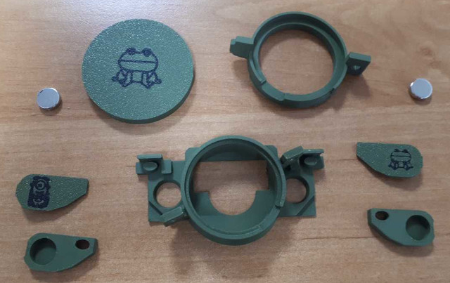
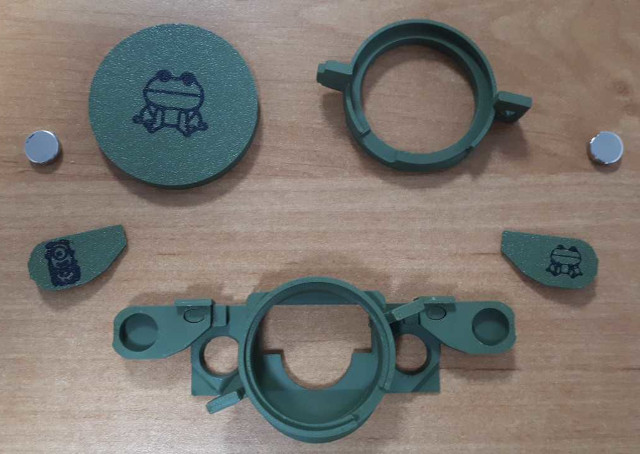
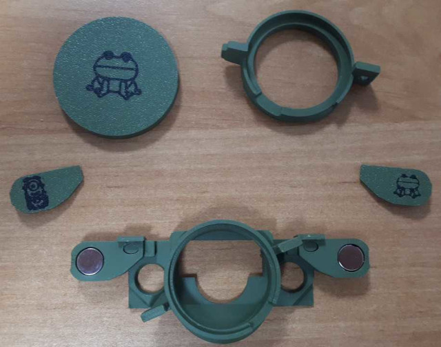
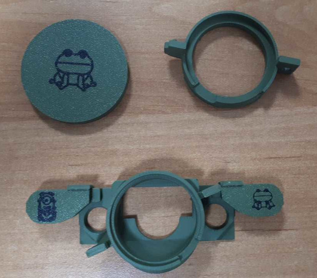
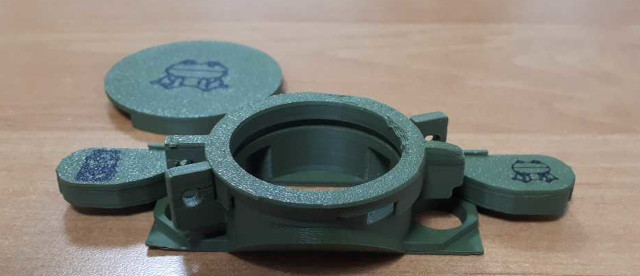
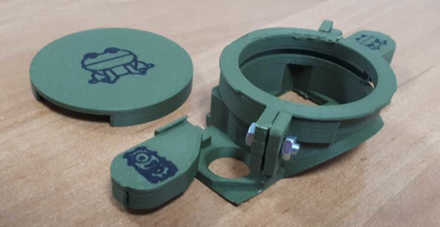
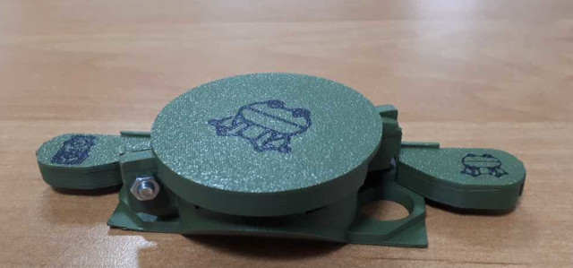

# Reconyx-glasses: Assembly process

This page illustrates the assembly process for the 3D-printed model in the [third design](stl/reconyx_magnets.stl). These assembly instructions may need to be adjusted to minor design changes, but the steps should still be valid.

The process assumes that you printed all the components and procured two round magnets (10mm diameter, 3mm thickness). The dimensions have been validated while printing on a Bambulab PS1, with 0.16mm layers and PLA plastics. 

All the components are visible here:

The first stage consist in attaching the magnet holders to the base plate of the lens holder. The magnet holders are just inserted on the elliptical pivots. Depending on the printing, it may fit more or less smoothly.

The magnets are then dropped into place:

And the magnet cover is clipsed in place:

The lens can then be placed in position, and the lens holder placed on top of it (the lens is absent in this picture). 

Rotate the lens holder to insert the pivot in the corresponding hole, and use a small screw (3mm diameter, 10mm length) to lock the assembly in place.

The "glasses" are ready to be attached to the Reconyx enclosure.

For transport and storage the lens cover can be inserted and twisted into place:

