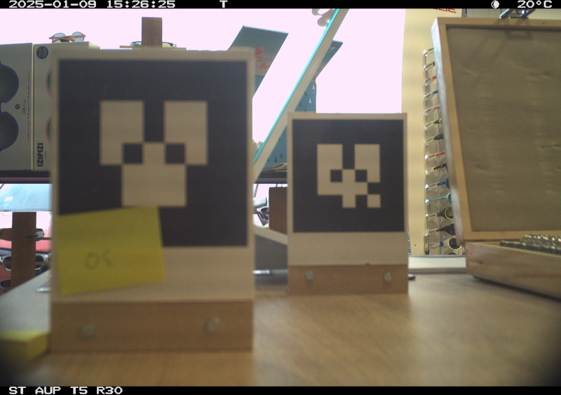
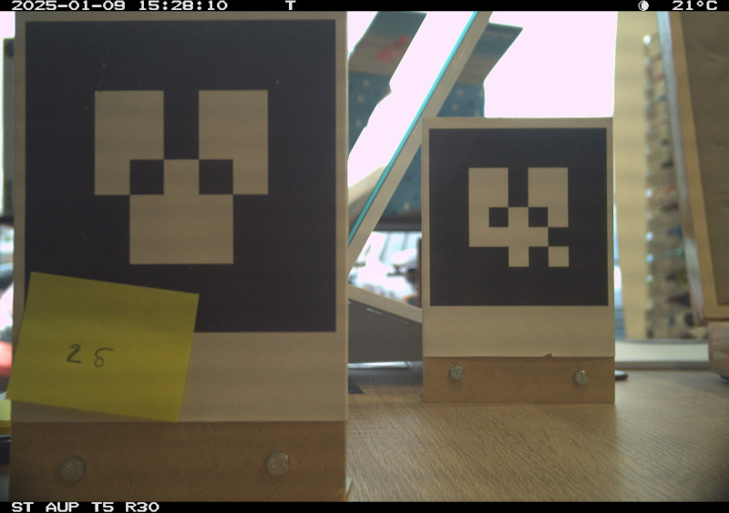
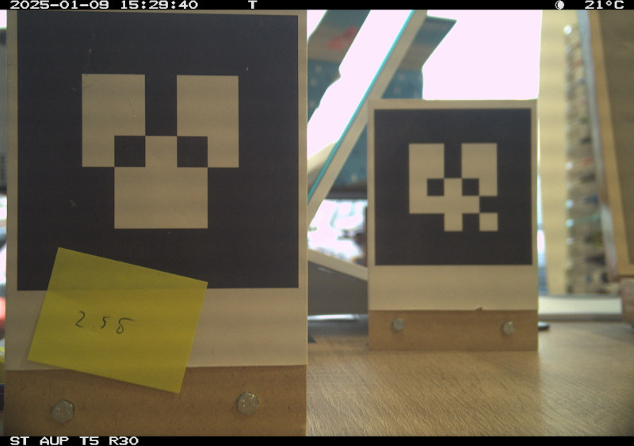
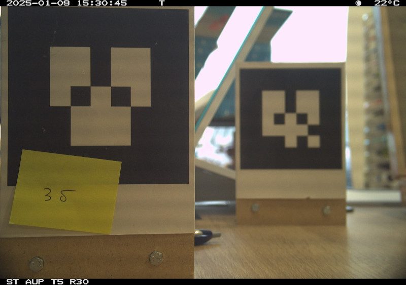
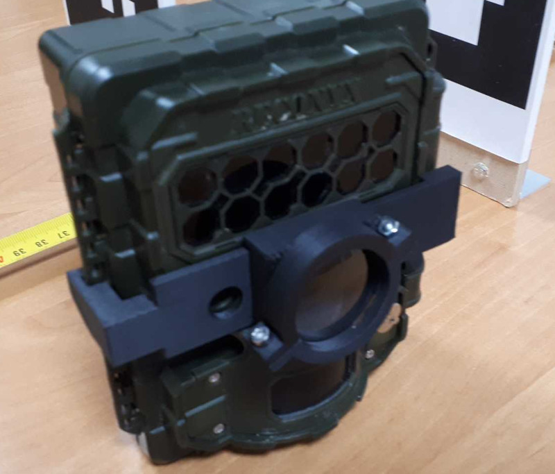
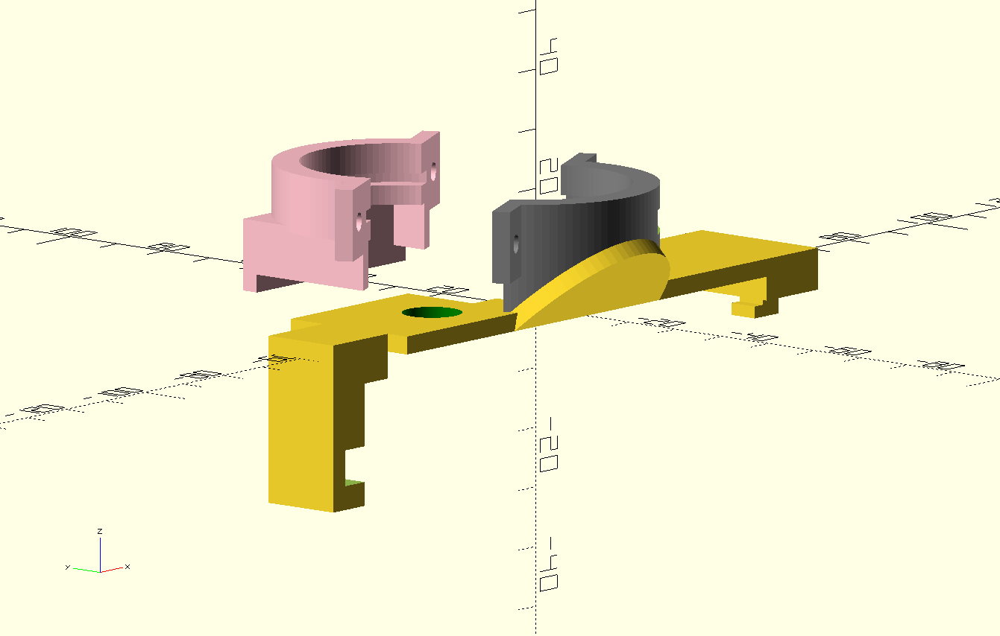
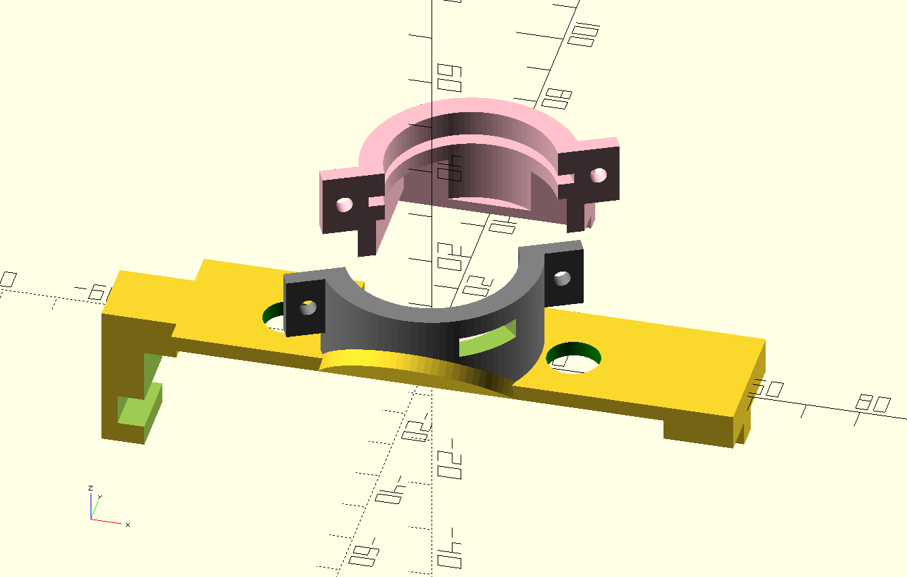
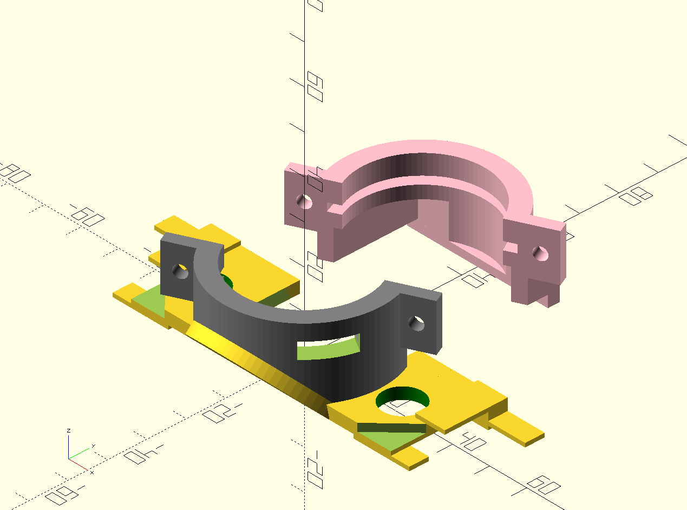
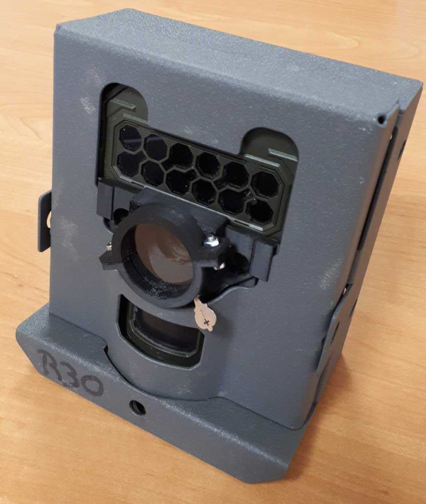
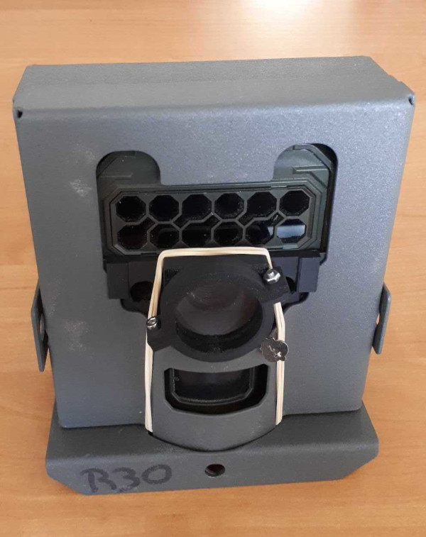

# reconyx-glasses
3D model of lens holders for the [Reconyx HyperFire](https://www.reconyx.com/product/Outdoor_Series?gad_source=1) cameras.

This repository includes some work on 3D models dedicated to attach a lens to the camera. The HyperFire camera is a rugged system designed for wild-life monitoring. As a result, the lens focus is fixed to infinity (a few meters away from the camera) and cannot be changed. In our application where the camera takes pictures of images relatively close to the lens, this leads to blurry images. Although this is not a problem in its normal use case, the camera is far-sighted (or even presbyopic) for our very specific use case (probably outside of the camera specifications in the first place) and it needs prescription glasses. 

## Lens testing
After some testing with my [optometrist](https://www.remillyoptic.fr/), this is the effect of choosing glasses from +2.0 to 3.0 dioptries, to observe an object 40cm away from the camera.
Without lenses:

With +2.0 correction:

With +2.5 correction:

With +3.0 correction:

## Designs
The resulting lens holder is designed with [OpenSCAD](https://openscad.org/) to be 3D printed. The SCAD files are in the [scad](scad) folder. The resulting STL files in the [stl](stl) folder.

The first design (reconyx_clip.scad) clips on the camera without any enclosure. 

The second design (reconyx_box.scad) is kept in place by [Reconyx enclosure box](https://www.reconyx.com/product/HyperFire-2-Security-Enclosure).

The camera, in its enclosure, with the lens on is displayed here:

Adding a tiny rubber band forces the lens in place, while keeping a little bit of flexibility when opening or closing the enclosure:

## Finding lenses

The proposed model is designed to hold [optometrist test lenses](https://m.media-amazon.com/images/I/51xljETiMxL._AC_SX679_.jpg), which are 38mm wide and 2mm thick. It is relatively easy to find 40mm lenses as [high-school optics material](https://jeulin.com/ovio_fr/pr-323333.html). This can be changed with the Dlens and Tlens variables in the scad files. 

The rule of thumb for selecting the focal or the dioptries is simple. The focal should approximately be equivalent to the distance at which the animals are going to be imaged. The focal resulting from a lens is the inverse of the dioptries, in m. 

Dioptries | Distances
--- | ---
1 | 1.00 m
2 | 0.50 m
2.5 | 0.40 m
3 | 0.33 m
4 | 0.25 m

